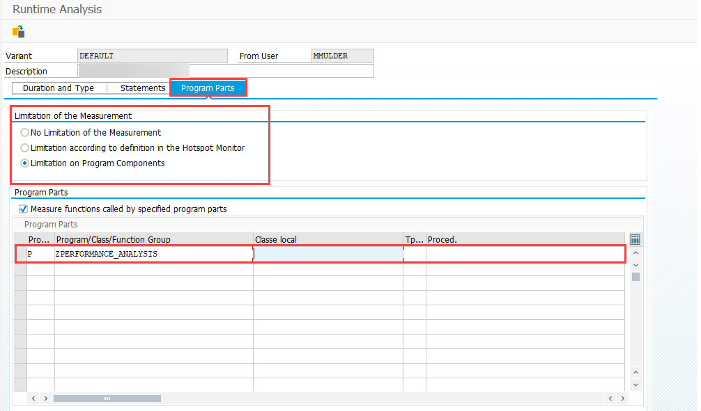
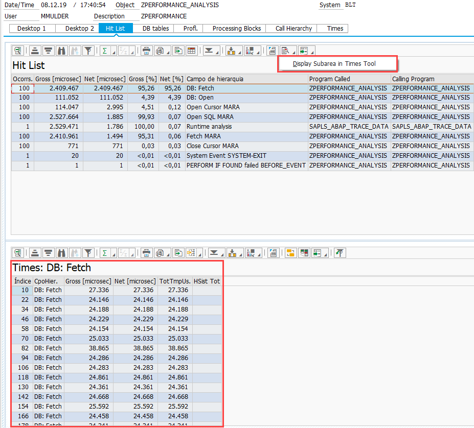

# SAT

1 - Create a new variant

2 - Set the options:

A - The 'Explicit Swtching On and Off of Measurement' option can be marked but you need to type "/ronf" and "/roff"

B-

C- 

3 - Execute

4 - See the profile load

5 - To analyze the times:

6 - Statement execution in details (See value per attempt)

7 - See ABAP code

